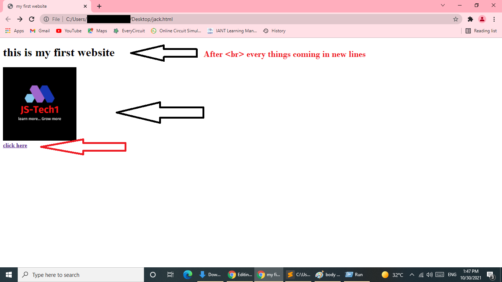

# Html

1. <strong>What is html?</strong><br>
	Ans-> html is Hyper Text Markup Language. that can be use for creating a web pages. Html is called structure of a Web page.

********************************************************************************************************************************************************************************* 
2. <strong>Why use of html? and why html is important?</strong><br>
Ans-> used to tell your web browser what each part of a website is. So, using HTML, you can define headers, paragraphs, links, images, and more, so your browser knows how to structure the web page you're looking at.
 
*********************************************************************************************************************************************************************************
3. <strong>how to write Html code?(basic structure of code)<p>⏩⏩for more information of code Editor Please<a href="more_information.md">Click Here</a></p></strong><br>
Ans->
	```language
		<!DOCTYPE html>

	<html>

	<head>
	<title></title>

	</head>

	<body>

	</body>
	</html>
	```


*********************************************************************************************************************************************************************************  
4.<strong> What is <!DOCTYPE html> ? Why we need to Declare? and why this important? </strong> <br>
 Ans-> ```<!DOCTYPE html>```  is not an HTML tag. It is an "information" to the browser about what document type to expect.
********************************************************************************************************************************************************************************
5. <strong>what is ```<html>``` tag?  why we neet declare and it's important?</strong><br>
 Ans-> ```<html>``` tag is represent as html document.
 ********************************************************************************************************************************************************************************
6.<strong> what is ```<head>``` tag ? why we use and it's important?</strong> <br>
 Ans-> The HTML ```<head>``` element is a container for the following elements: ```<title>, <style>, <meta>, <link>, <script>, and <base>```.
	<br>
	<br>				
	<p style="background-color: red">A. what is ```<title>``` tag? why we use ?</p>
	
*********************************************************************************************************************************************************************************
<strong>Example.</strong>	
		
```<!DOCTYPE html>
<html>
<head>
	<title>my first website</title>
</head>
<body>

</body>
</html>
```

		
*********************************************************************************************************************************************************************************

7. <strong>What is <body> tag? whyy we need to type?</strong><br>
Ans-> The <body> element contains all the contents of an HTML document.<br>
	<br>
		<br>
		<br>
*********************************************************************************************************************************************************************************
<strong>Example.</strong>
```example
<!DOCTYPE html>
<html>
<head>
<title>my first website</title>
</head>
<body>
	<h1>this is my first website</h1>
	<br>
	<a href="type here you want link">click here</a>
</body>
</html>
```	
*******************************************************************************************************************************************************************************		
<strong>Program 1:</strong>
```
<!DOCTYPE html>
<html>
<head>
<title>my first website</title>
</head>
<body>
	<h1>this is my first website</h1>
	<br>
	<a href="https://github.com/js-tech1/Html.git"><strong>click here</strong></a> <!-- <strong> tag is use for bold text and <br> is use for break line. you type <br> in every line than every things comeing in new lines-->
</body>
</html>
```
		
<strong>Output:-</strong>
<br>

		
******************************************************************************************************************************************************************

<strong>• some Basic tags in Html. we understand with simple program.</strong>
```
<!DOCTYPE html>
<html lang="en">
<head>
    <title>Demo website</title>
</head>
<body>
    <h1>thist is for heading</h1>
    <h2>thist is for heading</h2>
    <h3>thist is for heading</h3>
    <h4>thist is for heading</h4>
    <h5>thist is for heading</h5>
    <h6>thist is for heading</h6>

    <p style="color:red; background-color: black;">this is for write pregraph... you can type any peregraph and style tag is use for giving style to peregraph</p>
    
    <br>
    <br>
    <a href="https://github.com/js-tech1/Html" style="background-color:black;color: red;">Click Here</a>
</body>
</html>
```
<br>
<br>
<br>
<br>
<br>
<br>
		
<strong>Output:-</strong>
<br>
<br>
<br>

		
******************************************************************************************************************************************************************
		
 • ```<h1>``` to ```<h6>``` tag is use to Heading for peregraph or web site Heading<br>
 • ```<p>``` tag is use for peregraph. you can type log peregraph useing this tag<br>
 • ```style``` tag is for for giving style to peregraph and heading like back groung color and text color etc...<br>
 • `````` tag is use for show image on website and ```src=" "``` is use for image source you need to type image path where image store<br>
 • ```alt=" "``` image not showing in website that time we can use ```alt``` tag
<hr>
		
