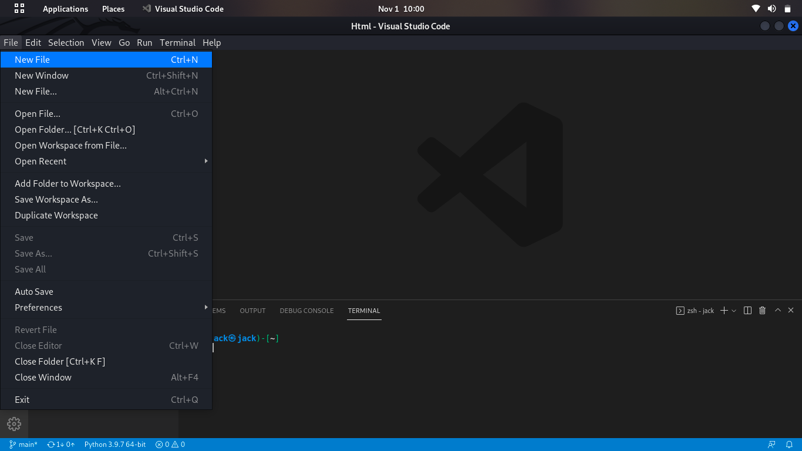
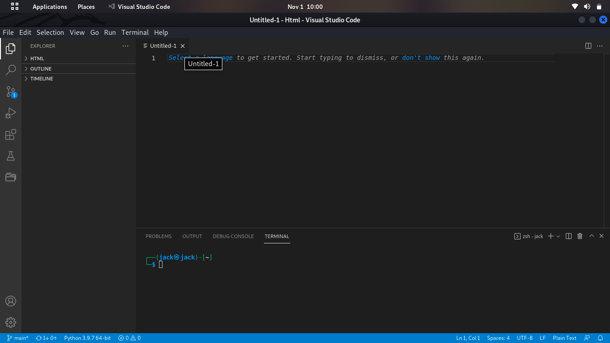
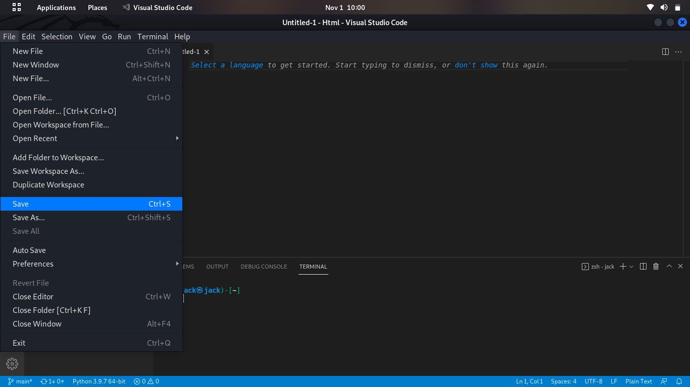
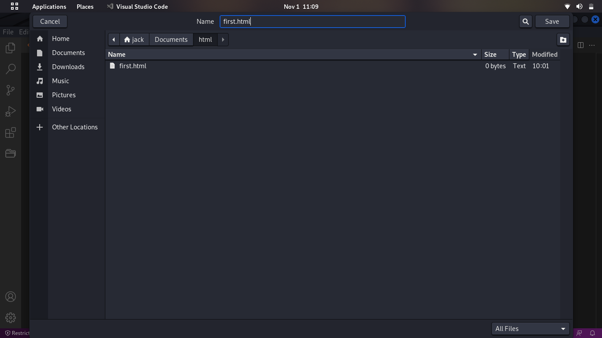

1. Where to type code? (for windows)<br>
Ans:- we have many choice whre we want to type code for Example.. we have subline, vs code, notepad, notepad++, Bootstrap Studio etc... <br>


A.<a href="https://www.sublimetext.com/download">Subline</a> you can download for here.<br>
To start a new HTML page, first create a new file in Sublime Text and save it with the .html extension. This will set the syntax of your document to HTML. Then type ! (that’s an exclamation point) otherwise type ```<html>``` and hit Tab to expand it. Emmet will create the HTML page structure for you
 
⏩ . How to type code in Editor?<br>
⚪ Press Windows key -> search your Editor and press enter-> open Editor

⏩ . How to open new file in Editor?<br>
⚪ . 
<br>
********************************************************************************************************************************************************************



********************************************************************************************************************************************************************



********************************************************************************************************************************************************************



********************************************************************************************************************************************************************

we have multiiple choice for code editor .....

